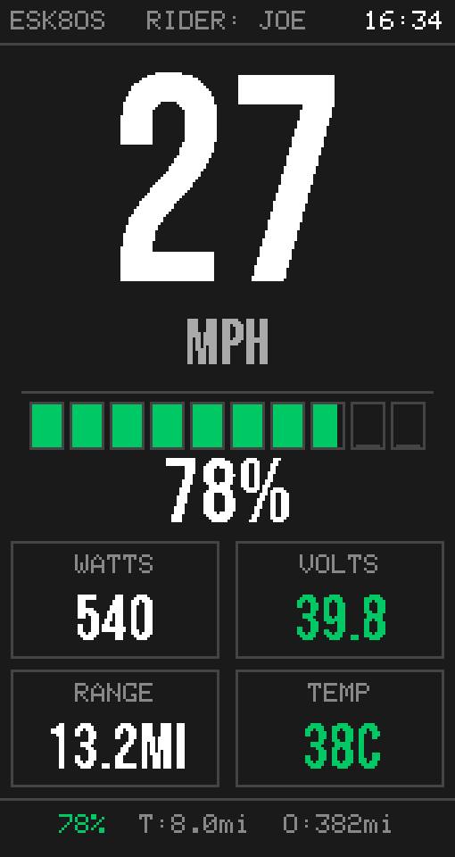

# EVEE · ESK8OS

Open telemetry for VESC-based personal electric vehicles. ESK8OS is the
electric-skateboard edition: a dashboard computer that plugs into your ESC's
COMM port, reads it a dozen times a second, and turns that into live screens,
honest battery math, ride logging, and a phone app.

**Read-only by design** — the only thing this firmware ever writes to the ESC
is the odometer. It cannot command current, duty, or cutoffs, so a dashboard
fault can never become a ride fault.

<p align="center">
  
</p>

**Site & manual:** [evee.zombie.digital](https://evee.zombie.digital) ·
[wiring / install manual](https://evee.zombie.digital/manual.html) ·
[release feed](https://apps.zombie.digital/downloads/esk8os-firmware/latest.json) ·
[companion app](https://github.com/joenilan/esk8os_mobile)

## Highlights

- **One firmware, three kinds of glass** — full color dashboard, 0.91" OLED
  glance display, or fully headless with the phone as the UI. Less display
  simply moves more of the picture to the app.
- **Self-configuring** — three config tiers: *rider override → VESC-read base →
  neutral default*. On first link the board reads the ESC's own configuration
  (cells, pack Ah, cutoff voltages, motor poles, gearing, wheel size) and uses
  it as ground truth; anything you change is kept as an explicit override. The
  `cfg` console command and the app show the provenance of every value.
- **Dual VESC over CAN** — the second ESC is auto-detected; per-motor currents
  and temps, aggregated power and energy.
- **Honest battery math** — sag-compensated charge, learned pack resistance,
  learned deliverable energy and consumption; range that predicts the *loaded*
  cutoff, not the resting one.
- **Black-box ride logs** — 1 Hz CSV per session on flash (volts, amps, temps,
  faults, per-motor split) with link-loss and voltage-collapse events flushed
  the instant they happen. Bench boots can never rotate real ride data away.
- **Companion app** — BLE telemetry at 5 Hz, GPS ride recording with the board
  as the source of truth, settings with base-vs-override visibility, remote
  face/page control for buttonless boards.
- **VESC Tool bridge** — configure your ESC wirelessly through the board
  (desktop over WiFi-TCP, mobile over BLE). Credentials are per-device and
  shown on screen.
- **OTA updates + log export** — the board raises its own AP and serves logs
  and a firmware updater at `http://192.168.4.1`.
- **Eight themes**, four HUD faces, screensaver with pairing code, serial
  console for everything.

## Hardware & wiring

Full wiring guide (VESC COMM pinout, OLED add-on, which USB port, cautions):
**[the manual](https://evee.zombie.digital/manual.html)**. The short version —
four wires to a VESC COMM port:

| VESC COMM | EVEE board |
|---|---|
| 5V | 5V (the ESC powers the board) |
| GND | GND |
| TX | GPIO 18 (board RX) |
| RX | GPIO 17 (board TX) |

UART app enabled in VESC Tool ("PPM and UART" keeps a PPM remote working),
baud 115200. ⚠ **One 5V source at a time** — never USB and vehicle power
together.

## Build & flash

Uses [PlatformIO](https://platformio.org/):

| Environment | Target | Notes |
|---|---|---|
| `tdisplay_s3_debug_usb` | LilyGO T-Display-S3 | Full TFT UI + USB serial console (bench/dev) |
| `tdisplay_s3_ride_release` | LilyGO T-Display-S3 | Ride build |
| `esp32s3_oled_i2c_usb` | Generic ESP32-S3 + SSD1306 | 128×32 OLED glance UI |
| `esp32s3_headless_usb` | Generic ESP32-S3 | No display; the app is the UI |
| `wokwi-simulator` | [Wokwi](https://wokwi.com/) | Generic ESP32 + ILI9341 stand-in, simulated telemetry |

```bash
pio run -e tdisplay_s3_debug_usb -t upload     # flash the LilyGO display board
pio run -e esp32s3_oled_i2c_usb -t upload      # generic S3 + OLED
pio run -e esp32s3_headless_usb -t upload      # generic S3, headless
```

The OLED env defaults to SSD1306 I²C at `0x3C`, SDA `GPIO8`, SCL `GPIO9`
(override with `-DOLED_SDA=…`, `-DOLED_SCL=…`, `-DOLED_ADDR=…`). Generic S3
builds drive an RGB status LED on `GPIO48` (`-DESK8OS_STATUS_RGB_PIN` to move
it): green = live telemetry, purple = demo, orange = no VESC, yellow/red =
warnings, cyan = WiFi/bridge.

Wokwi note: the simulator substitutes an SPI ILI9341; rebuild
`wokwi-simulator` and restart the sim to see changes — it loads the binary.

Boards ship with **demo mode on** (simulated telemetry, marked DEMO on
screen) so everything animates out of the box; turn it off from Settings, the
app, or `demo off` on the console once the VESC is wired.

## Serial console

All USB builds expose a console on native USB at 115200 — type `help`.
Highlights: `stat`/`diag` (live data + wire-level link diagnostics), `cfg`
(every setting with its `[rider|vesc|default]` source), `vstat` (the ESC's own
ride stats), `trip`/`odo`/`cal`, `logs`/`cat` (session CSVs), `mcconf` (raw
ESC config capture). Reference: [`docs/serial_console.md`](docs/serial_console.md).
`scripts/archive_sessions.py` pulls all session logs to the PC — **run it
before every flash**.

## Repo layout & docs

- `src/` — firmware (transports, telemetry, UI renderers, services, config)
- `docs/` — [serial console](docs/serial_console.md),
  [companion BLE API](docs/companion_api_spec.md), investigation notes
- `site/evee/` — the website + manual (`scripts/deploy_site.py` deploys)
- `scripts/` — release packaging, session archiving, serial probe, previews
- [`PERFORMANCE.md`](PERFORMANCE.md) — rendering architecture and the
  dirty-band double-buffer pipeline

## Versioning

`version.txt` holds the semver; a pre-build hook stamps `src/version.h` with
the git hash (+`-dirty` when the tree isn't clean) and build date. The System
page / `sys` command show the full stamp, so every board is traceable to a
commit.

## Fonts

The UI uses [Bebas Neue](https://github.com/dharmatype/Bebas-Neue) by Dharma
Type (SIL OFL 1.1, see `OFL.txt`); the `src/ui/BebasNeue*.h` headers are
GFX-format derivatives.
