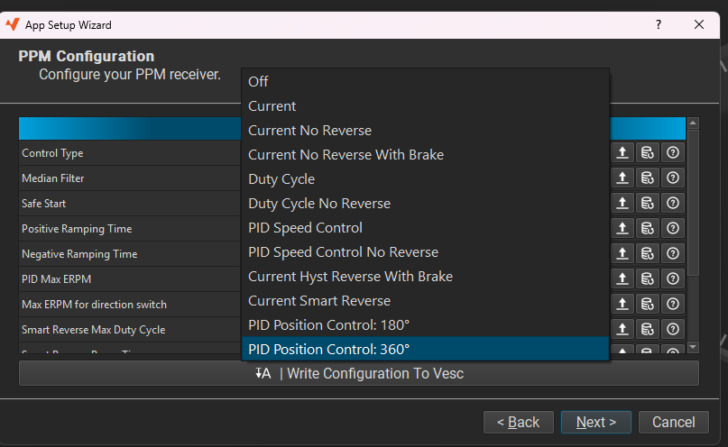

# Esk8 OS

A telemetry dashboard for an electric skateboard, running on a **LilyGo
T-Display S3** (ESP32-S3, 1.9" ST7789, 170×320). It reads live data from a
**VESC** over UART and renders speed, temperatures, range, and battery state
in an NZXT-CAM-inspired UI.



## Hardware

- **Board:** LilyGo T-Display S3 (ESP32-S3R8, 16MB flash / 8MB PSRAM)
- **Display:** ST7789 170×320, 8-bit parallel
- **Telemetry:** VESC over UART (RX 18 / TX 17)
- **Buttons:** GPIO0 (left), GPIO14 (right — toggles MPH/KM-H)

## FSESC UART wiring

Connect the display to one free FSESC comm port:

- ESP32 GPIO18 (`VESC_RX_PIN`) -> FSESC TX
- ESP32 GPIO17 (`VESC_TX_PIN`) -> FSESC RX
- ESP32 GND -> FSESC GND
- Optional power: FSESC comm port 5V -> display 5V/VBUS, if the port can supply the display

VESC UART logic is 3.3V, so no level shifter is expected.

## Pages

Cycle with a short Left press:

1. **Big HUD** — the default ride screen: huge speed, large battery cells +
   percent, and watts/volts/range/temp. No footer chrome, so it stays glanceable.
2. **Dashboard** — speed, volts/watts (color-zoned by load), temps, range
   (remaining distance also shows estimated time left)
3. **Power** — motor/battery amps, duty, peak watts, energy used/regen, max/avg
   speed, plus a session card (max power, min voltage)
4. **Trip** — trip time/distance/avg/max/efficiency and the odometer
5. **Settings** — an editable menu: wheel profile, units, demo on/off, display
   brightness, and battery setup (cells, pack Ah, stop-cell voltage, default
   Wh/mi). All settings persist in flash. These are display-side only — they do
   not change VESC cutoffs/limits.
6. **System** — live ESP32 stats: chip, firmware usage, free/min heap, PSRAM,
   internal temperature, uptime, refresh rate (FPS), last reset cause, and the
   firmware version (with git hash)
7. **Graphs** — four live mini line-graphs (speed, watts, volts, motor temp)
   over a rolling 3-minute in-RAM history, with trend arrows
8. **Logs** — the last 10 ride summaries (distance, max speed, Wh/dist, peak
   watts), saved to flash on each trip reset — not continuously, to spare flash

## Controls

- Left short press: next page. On the **Settings** page it instead steps the
  highlighted cursor down through the editable rows, then leaves to the next
  page after the last one.
- Left hold: reset trip (in demo mode this also recharges the pack and clears
  temps, so a bench session can run indefinitely)
- Right short press: toggle MPH/KM-H. On the **Settings** page it changes the
  highlighted setting (cycle wheel profile, toggle units, toggle demo, or step
  brightness).
- Both buttons held for about 2 seconds: prompts the VESC bridge mode confirmation overlay (`L = YES`, `R = CANCEL`).

Demo mode is now a runtime setting — toggle it from the Settings page instead of
reflashing. It persists across reboots.

Bridge entry is blocked during live telemetry while speed is above 1 km/h.
Stop the board first. Demo/simulated telemetry does not block bridge entry.

## VESC Tool bridge mode

Bridge mode temporarily stops dashboard polling and forwards raw bytes between
desktop VESC Tool and the FSESC UART.

- WiFi AP: `ESK8-BRIDGE`
- Password: `esk8bridge`
- TCP endpoint: `192.168.4.1:65102` (Desktop VESC Tool)
- BLE endpoint: `ESK8-BLE` (Mobile VESC Tool / Floaty App)

The active connection endpoints are shown on-screen. The bridge screen continuously displays
live link status, throughput (RX/TX bytes), and the connected client count for diagnostics.

> **Safety Timeout:** If the bridge is started but left idle with zero active clients and traffic for 3 minutes, it will automatically shut down the network radios and return to the dashboard to prevent battery drain and secure the board.

In desktop VESC Tool, connect to the AP, then use a TCP connection to that endpoint. For mobile (VESC Tool / Floaty), scan for the BLE device. The ESP32 handles transparently multiplexing both transports.

While bridge mode is active, dashboard telemetry is paused by design. The VESC Tool owns the UART during that session.

### Local Web Portal & OTA Updates

While in Bridge Mode, the ESP32 also spins up a local web server at `http://192.168.4.1`. From a connected phone or laptop, you can:
- **Download Ride Logs:** View a list of all your `.csv` ride logs and download them directly over Wi-Fi.
- **OTA Updates:** Upload a new `firmware.bin` directly through the browser. The display will show an `UPDATING...` progress bar and automatically reboot into the new firmware when complete. No USB cable required!

## Data sources

With demo mode **off**, speed, voltage, ESC temp, motor temp, current, duty,
Wh used, regen Wh, watts, and VESC faults come from the FSESC when dashboard
mode is active. The dashboard also supports listening for **ESP-NOW** packets on Core 0 for external auxiliary sensors (e.g. smart BMS modules) without blocking the display loop.

Trip and odometer are calculated locally on the ESP32 from speed over time and
saved in flash. Range estimates and health percentages are currently placeholders
until those models/sensors are implemented. Battery temperature comes from the
VESC only if a sensor is wired; otherwise it reads as a placeholder.

With demo mode **on** (or the Wokwi build), the full telemetry set is
simulated — including load-proportional current with regen braking, integrated
Wh, and thermal models for motor/ESC/battery — so every page animates without an
ESC connected. Demo mode also shortens the range learn-in so the estimate moves
on the bench. **This repo currently ships with demo mode on** so it runs out of
the box; turn it off from the Settings page once your VESC is wired in (it's a
runtime toggle now, persisted in flash — no reflashing needed).

## Build & flash

Uses [PlatformIO](https://platformio.org/). Main environments:

| Environment | Target | Notes |
|---|---|---|
| `tdisplay_s3_debug_usb` | LilyGO T-Display-S3 | Full TFT UI, USB serial console, real VESC over UART |
| `esp32s3_headless_usb` | Generic ESP32-S3 | No onboard display; phone app is the UI |
| `esp32s3_oled_i2c_usb` | Generic ESP32-S3 + SSD1306 | Tiny OLED glance UI; phone chooses speed/battery/watts face |
| `wokwi-simulator` | [Wokwi](https://wokwi.com/) | Generic ESP32 + ILI9341 stand-in, fake telemetry |

```bash
pio run -e tdisplay_s3_debug_usb -t upload       # flash the LilyGO display board
pio run -e esp32s3_headless_usb                  # build generic headless ESP32-S3
pio run -e esp32s3_oled_i2c_usb                  # build generic ESP32-S3 + OLED
pio run -e wokwi-simulator                       # build for the simulator
```

The OLED env defaults to SSD1306 I2C at address `0x3C`, SDA `GPIO8`, SCL
`GPIO9`. Override with PlatformIO build flags (`-DOLED_SDA=...`,
`-DOLED_SCL=...`, `-DOLED_ADDR=...`) if the test board wiring needs it.

Generic ESP32-S3 builds also enable an onboard addressable RGB status LED on
`GPIO48` by default (`-DESK8OS_STATUS_RGB_PIN=48`). Override the pin in
`platformio.ini` if a board uses a different RGB LED pin. Status colors:
blue=boot/idle, purple=demo telemetry, green=real VESC telemetry, orange=no
VESC data, yellow=turn-home warning, red=fault/limp, cyan=WiFi/bridge/export.

> Wokwi has no 8-bit-parallel ST7789 support, so the simulator substitutes an
> SPI ILI9341 at 240×320. The UI is drawn in a centered 170px band, so what you
> see in that band matches the device.

### Running / updating the Wokwi simulator

`wokwi.toml` points the [Wokwi VS Code extension](https://docs.wokwi.com/vscode/getting-started)
at `.pio/build/wokwi-simulator/firmware.bin`. To see code changes in the sim you
must **rebuild that env, then restart the simulation** — the sim loads the
binary, so it won't update on its own:

```bash
pio run -e wokwi-simulator     # rebuild the sim binary
```

Then start/restart Wokwi (Command Palette → “Wokwi: Start Simulator”). Building
only the `lilygo` env leaves the sim binary stale, so the sim keeps showing old
code — a common gotcha.

## Serial console

The `*_debug_usb` LilyGO builds expose a USB serial console (115200 baud).
Generic ESP32-S3 builds mirror the same console on native USB CDC and `Serial0`
for boards with a CH343/USB-UART port. Use it for bench debugging and driving
the board without BLE — live telemetry (`stat`), trip/config dumps (`trip`,
`sys`, `cfg`), and actions (`demo`, `units`, `bright`, `rider`, `trip reset`,
`reboot`). Type `help` for the full list. See
[`docs/serial_console.md`](docs/serial_console.md) for the reference and the
`scripts/serial_query.py` helper.

## Versioning

The version is stamped at build time, so every build is traceable. The semantic
version lives in `version.txt` (`MAJOR.MINOR.PATCH`); bump it as part of each
meaningful change. A PlatformIO pre-build hook (`scripts/gen_version.py`) reads
it and writes `src/version.h` (gitignored) with the git short hash, a `-dirty`
flag when the tree has uncommitted changes, and the build date. The splash and
top-corner show `FW_VERSION` (e.g. `v0.4.0`); the System page shows
`FW_VERSION_FULL` (e.g. `v0.4.0 a1b2c3d`).

## Performance

The UI is double-buffered: every widget renders into an off-screen canvas in
fast internal SRAM, and only changed frames are blitted to the panel, so there's
no flicker and the bus is idle when nothing moves. See
[`PERFORMANCE.md`](PERFORMANCE.md) for the rendering architecture, the parallel-
bus DMA situation, applied optimizations, and the roadmap. The on-device
**System** page shows live FPS and where the canvas landed (SRAM/PSRAM).

## Design preview

`preview.py` renders the UI at the exact 170×320 panel resolution to a PNG, so
layout can be iterated without flashing hardware:

```bash
python preview.py            # dashboard
python preview.py --splash   # boot splash
python preview.py --kmh      # metric units
```

## Configuration

Rider name, product name, version, and default units live in the `USER CONFIG`
block at the top of `src/main.cpp`.

Demo mode is a runtime setting (toggle it on the Settings page); use it for
bench-testing the UI without the FSESC connected, and turn it off for live
telemetry. The first-boot default is `DEMO_MODE_DEFAULT` in that same block.

Battery/range assumptions are also in `USER CONFIG`. The current default is a
10S6P pack with 2800 mAh nominal cells and `BATTERY_EFFECTIVE_CAPACITY_AH =
16.5`, which is the value the range estimate uses. Change that effective Ah
value to match the capacity you set in VESC Tool.

Range is intentionally based on usable energy down to `BATTERY_STOP_CELL_V`, not
fully dead cells. The default is `BATTERY_STOP_CELL_V = 3.30`, so dashboard 0%
means stop riding with voltage margin. Range starts from `RANGE_DEFAULT_WH_PER_MILE
= 22.0` and only switches to learned ride efficiency after at least about 1 mile
and 20 Wh, so bench/free-spin testing does not create nonsense 100+ mile
estimates.

In live mode, the boot splash is a real loader: it waits at `CONNECTING TO VESC`
until the FSESC answers over UART. If the dashboard never appears, check TX/RX,
GND, UART baud/app settings, and that the FSESC is powered.

## Fonts

The UI uses [Bebas Neue](https://github.com/dharmatype/Bebas-Neue) by Dharma
Type, licensed under the SIL Open Font License 1.1 (see `OFL.txt`). The
`src/BebasNeue*.h` headers are GFX-format derivatives generated from
`BebasNeue.ttf`.
